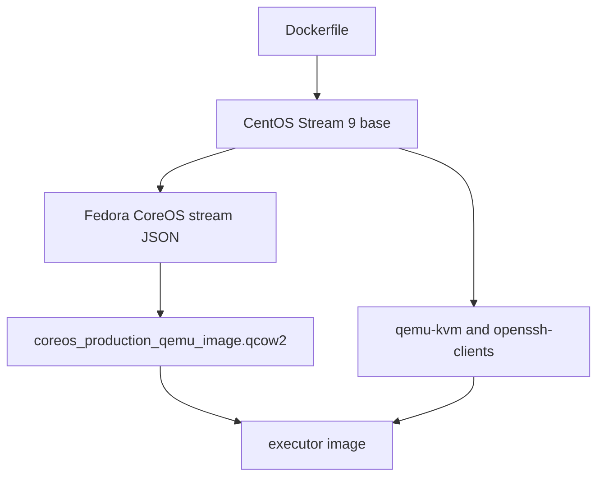
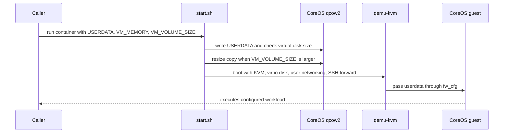

# quay-builder-qemu Architecture

`quay-builder-qemu` packages a Fedora CoreOS QEMU disk image with enough host tooling to boot that image inside a container. It is an executor building block for Quay builder flows that need stronger isolation than a normal container process.

## Build-Time Flow

The Dockerfile uses a multi-stage build:

- `base`: installs `jq` and `xz`, then reads Fedora CoreOS stream metadata.
- `executor-img`: downloads and unpacks the QEMU `qcow2.xz` image.
- `final`: installs runtime tools, copies the disk image and `start.sh`, and sets the entrypoint.

## Runtime Flow

`start.sh` boots with:

- KVM acceleration and host CPU passthrough.
- Virtio disk backed by `/userdata/coreos_production_qemu_image.qcow2`.
- `fw_cfg` userdata injection at `opt/com.coreos/config`.
- User-mode networking with host port `2222` forwarded to guest SSH port `22`.
- Two virtual CPUs and configurable memory.

## Inputs

- `USERDATA`: required guest configuration. The script writes this to `/userdata/user_data`.
- `VM_VOLUME_SIZE`: optional disk size, default `32G`.
- `VM_MEMORY`: optional memory size, default `4G`.
- `CHANNEL`: Fedora CoreOS stream used at build time, default `stable`.
- `CLOUD_IMAGE`: optional explicit CoreOS image location for `build.sh`.
- `IMAGE` and `TAG`: target image name for `build.sh`.

## Security Boundary

The VM boundary is the point of this repo. Builds or workloads that run in the guest should not rely on the container filesystem for isolation. The container still needs elevated runtime permissions for KVM, so cluster-level policy and node placement remain important.

## Operational Notes

- The repository does not contain Quay build manager code; see `quay-builder` and `quay/buildman` for job orchestration.
- Keep Fedora CoreOS channel updates deliberate. A channel bump changes the guest operating system for every downstream executor image.
- Validate changes by building the image and booting it with minimal userdata before wiring it into a Quay builder workflow.
