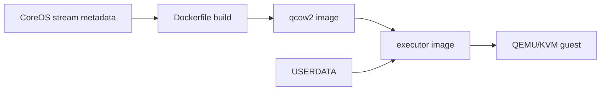

# Builder Image

```
docker build --build-arg channel=stable -t quay.io/quay/quay-builder-qemu-coreos:staging .
```

## Contextification Addendum



Key files: `Dockerfile`, `start.sh`, and `build.sh`. Validate image build with:

```bash
TAG=test IMAGE=quay-builder-qemu ./build.sh
```

Full validation needs a host that can run privileged containers with KVM.
